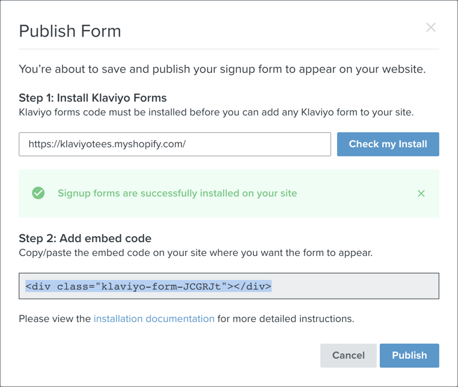

# @nacelle/react-klaviyo

Adds React components for [Klaviyo](https://www.klaviyo.com/) forms and event tracking in your [Nacelle](https://getnacelle.com/) project.


## Requirements

- A Nacelle project set up locally. See https://docs.getnacelle.com for getting started.
- A Klaviyo account and app installed on your Shopify store.

## Setup

### Add Module to Nacelle

Once you have Nacelle and Recharge set up you can install this module in your project from `npm`:

```
npm install @nacelle/react-klaviyo -S
```

After the package is installed, you'll need to create a `.env` file in the root of the project that contains credentials for your store:

```
KLAVIYO_COMPANY_ID=
KLAVIYO_FORM_EMBED_CODE=
```

The company ID is found in the `Acccounts > Settings > API Keys` section of the Klaviyo admin dashboard.


The Klaviyo embed form code can be found when you publish a form. The dashboard will show you an HTML embed code, but we will only need the ID that comes _after_ `form-`:



In the above example, the `EMBED_FORM_CODE` would be `JCGRJt`.

## Usage

### KlaviyoForm

Provides the HTML element that the Klaviyo form will use to inject your custom form.

```jsx
import { KlaviyoForm } from '@nacelle/react-klaviyo';

<KlaviyoForm />;
```

### KlaviyoScripts

Provides a component that will mount `<script>` tags with the Klaviyo JS scripts. This component should be used at the bottom of the `<body>` element.

```jsx
import { KlaviyoScripts } from '@nacelle/react-klaviyo';

<body>
  <!-- app code -->
  <KlaviyoScripts />
</body>
```

### Klaviyo Tracking Service

Provides convenience methods for tracking events with Klaviyo. If the Klaviyo SDK has not loaded, the events will be no-ops.

Methods:

- **viewedProduct:** Track a product view event
- **addedToCart:** Track an add to cart event
- **setCustomer:** Set the current active customer (by e-mail)

### Example

An example integration with Nextjs can be found [here](https://github.com/getnacelle/nacelle-react/tree/main/examples/withKlaviyo).
